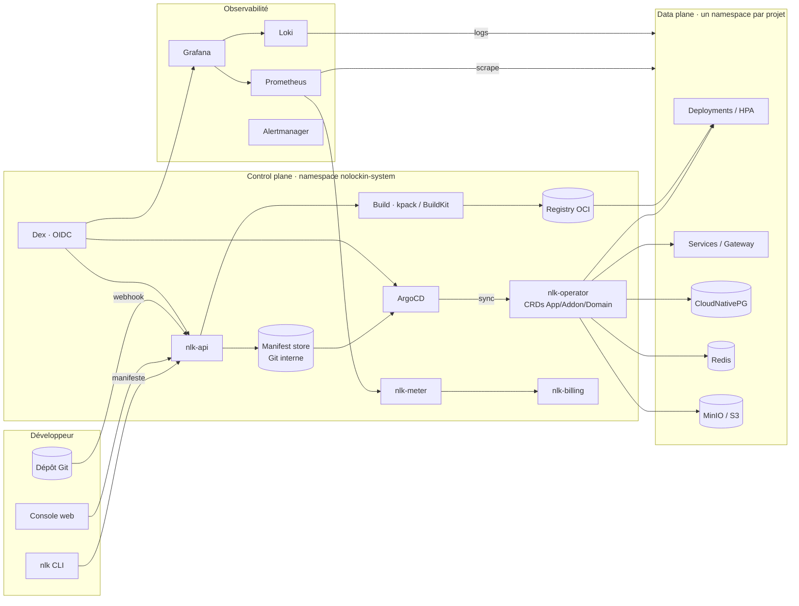
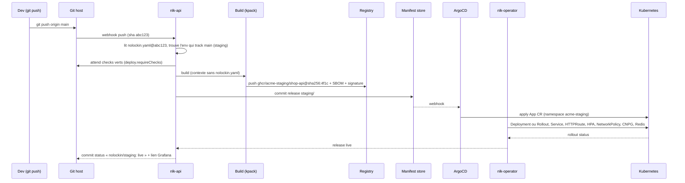
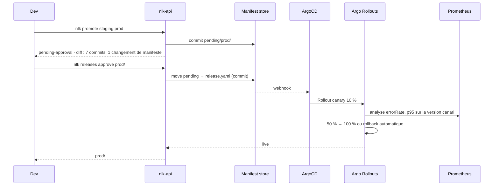

# 01 · Architecture

## Vue d'ensemble

NoLockIn est une couche fine au-dessus de Kubernetes, composée exclusivement de projets
open source assemblés par un chart Helm umbrella. Le control plane transforme un
`nolockin.yaml` en objets Kubernetes standard, ArgoCD les réconcilie, la stack Prometheus
les observe et les mesure.



## Composants

Tous les composants sont installés par le chart `nolockin`. Chaque ligne indique le projet
open source retenu, son rôle, et la « sortie standard » qui garantit qu'on peut s'en défaire.

| Composant | Projet | Rôle | Sortie standard |
|---|---|---|---|
| `nlk-api` | NoLockIn (Go) | API REST/gRPC. Reçoit les manifestes, valide, écrit dans le manifest store, déclenche les builds, expose logs/metrics/usage. | OpenAPI publié |
| `nlk-operator` | NoLockIn (Go, controller-runtime) | Réconcilie les CRDs `App`, `Addon`, `Domain` vers Deployments, Services, HTTPRoutes, HPA, PVC, NetworkPolicies, clusters CNPG. | `nlk render` produit le YAML Kubernetes équivalent |
| Manifest store | Git bare (Gitea embarqué ou dépôt utilisateur) | Porte **l'état** : la release live de chaque environnement (digest, SHA, rendu), les releases en attente, l'historique. Source de vérité d'ArgoCD. Le dépôt source de l'utilisateur porte la **politique** ([ADR-0007](adr/0007-policy-in-repo-state-in-store.md)). | `git clone` |
| ArgoCD | argoproj/argo-cd | Réconciliation GitOps : la plateforme elle-même (app-of-apps) et chaque projet. UI en lecture seule pour l'utilisateur. | Applications ArgoCD standard |
| Argo Rollouts | argoproj/argo-rollouts | Stratégies `canary` et `blueGreen` : trafic pondéré via Gateway API, analyse sur les métriques Prometheus, rollback automatique. | `Rollout` convertible en Deployment (`kubectl argo rollouts` ou `nlk render --strategy rolling`) |
| Build | kpack (Cloud Native Buildpacks) + BuildKit (Dockerfile) | Transforme un commit en image OCI reproductible. | Images OCI, SBOM SPDX |
| Registry | distribution/distribution (ou Harbor en option) | Stockage des images par projet. BYO registry supporté. | `crane copy` |
| Gateway | Envoy Gateway (Gateway API) | Routage HTTP/gRPC/TCP, TLS, rate limiting. | HTTPRoute / Gateway API standard |
| cert-manager | cert-manager | Certificats Let's Encrypt, DNS-01 ou HTTP-01. | Secrets TLS standard |
| Prometheus + Alertmanager | kube-prometheus-stack | Métriques infra et applicatives, alertes par défaut. | Remote write, export |
| Grafana | grafana/grafana | Dashboards provisionnés par app, par projet, facture. | Dashboards JSON dans le dépôt |
| Loki + Alloy | grafana/loki | Logs centralisés, rétention par projet. | LogQL, export S3 |
| Tempo (optionnel) | grafana/tempo | Traces OTLP. | OTLP standard |
| CloudNativePG | cloudnative-pg | Postgres HA, backups continus, réplication logique pour la sortie. | `pg_dump`, réplication logique, WAL sur S3 |
| Redis | OT-CONTAINER-KIT/redis-operator | Cache et files. | RDB/AOF |
| MinIO | minio/minio | Stockage objet S3-compatible par projet. | `rclone`, `mc mirror` |
| `nlk-meter` | NoLockIn | Agrège les métriques Prometheus en enregistrements d'usage par projet, à la minute. | Table `usage_records` exportable en CSV/Parquet |
| `nlk-billing` | NoLockIn | Applique la grille de prix aux usages, génère factures. Mode `stripe` (hébergé), `showback` (self-hosted) ou `off`. | Factures JSON + PDF, grille YAML |
| Dex | dexidp/dex | OIDC. Hébergé : GitHub/Google/email. Self-hosted : votre IdP. | OIDC standard |
| External Secrets (optionnel) | external-secrets | Synchronise Vault/AWS SM/GCP SM vers les secrets de projet. | Secrets Kubernetes |
| Trivy | aquasecurity/trivy-operator | Scan des images, SBOM, rapports dans la console. | Rapports SARIF |

## Le modèle de contexte

Un **contexte** est l'unité de portabilité : un nom, l'URL d'un `nlk-api`, une identité OIDC.

```yaml
# ~/.config/nolockin/config.yaml
current: hosted
contexts:
  hosted:
    server: https://api.nolockin.cloud
    auth: oidc
  mon-cluster:
    server: https://nlk.infra.acme.internal
    auth: oidc
    issuer: https://sso.acme.com
```

Le même manifeste, la même CLI et la même console fonctionnent contre n'importe quel
contexte. La différence entre hébergé et self-hosted est un flag dans les values Helm :

```yaml
billing:
  mode: stripe      # hébergé
  # mode: showback  # self-hosted : mesure et affiche, ne facture pas
  # mode: off
```

## Flux de déploiement

Le déclencheur par défaut est un push sur la branche suivie par un environnement. `nlk deploy`,
`nlk promote` et `nlk releases approve` entrent dans le même flux au niveau de `nlk-api`.



Promotion vers la prod, sans build :



Durée cible d'une release sans rebuild (promotion, rollback, changement de manifeste) :
**< 30 s** jusqu'au début du rollout. Avec build buildpacks à cache chaud : **< 2 min**.

## Modèle de release

Le manifest store est organisé par projet, donc par environnement :

```
projects/acme-staging/apps/shop-api/
  release.yaml          # release live : App CR rendue (manifeste effectif + digest), suivie par ArgoCD
  releases/0118.yaml    # historique immuable
  overrides.yaml        # overrides impératifs (nlk scale --env) en attente de merge
projects/acme-prod/apps/shop-api/
  release.yaml
  pending/0042.yaml     # en attente d'approbation ou en file (freeze)
  releases/0041.yaml
```

- **Approuver** = déplacer `pending/0042.yaml` vers `release.yaml`, en un commit signé par l'approbateur.
- **Rollback** = nouveau `release.yaml` avec le contenu d'une release passée. Jamais un `git revert` : l'historique reste linéaire et lisible.
- **Overrides** = rendus par l'opérateur par-dessus `release.yaml`, tracés, affichés comme dérive, effacés quand le manifeste les rattrape.
- **BYO manifest repo** : `nlk project set --manifest-repo` pointe cette arborescence sur un dépôt de l'utilisateur. `nlk promote` y ouvre une PR, la merger vaut approbation.

Le dépôt source n'est **jamais** écrit par la plateforme, à deux exceptions près, toutes deux
initiées par l'utilisateur : la PR qu'ouvre `nlk init` depuis la console, et les PR de
politique qu'ouvrent les commandes impératives. Le tag `nlk/<env>` (`tagOnRelease`) est
une référence en lecture seule.

## Flux d'une requête

```
Internet → DNS (*.nolockin.app ou domaine custom)
        → LoadBalancer cloud
        → Envoy Gateway (TLS terminé, cert-manager)
        → HTTPRoute (namespace acme, host api.acme.com)
        → Service shop-api-web
        → Pods (Deployment, HPA 2..10)
```

Chaque saut est un objet Kubernetes standard visible avec `kubectl -n acme get`.

## Flux de metering

```
kubelet/cAdvisor ──► Prometheus ──(recording rules à 1 min)──► nlk-meter ──► usage_records
                                                                              │
                     Grafana « Facture » ◄────────── nlk-billing ◄────────────┘
                                                        │
                                                 Stripe (hébergé) / rien (showback)
```

Les recording rules sont publiées dans le dépôt (`charts/nolockin/rules/metering.yaml`).
La facture et le dashboard consomment **les mêmes séries**. Détails dans
[Tarification et metering](../reference/tarification.md).

## Correspondance manifeste → Kubernetes

Le principe : chaque concept du manifeste correspond à un ou plusieurs objets Kubernetes
standards, sans intermédiaire opaque.

| Manifeste | Objets Kubernetes générés |
|---|---|
| `environments.<env>.project` (ou `metadata.project`) | Namespace, ResourceQuota, LimitRange, NetworkPolicy default-deny, ServiceAccount, AppProject ArgoCD |
| `services[]` avec `deploy.strategy: rolling` | Deployment, Service, HTTPRoute, HorizontalPodAutoscaler, PodDisruptionBudget, ServiceMonitor |
| `services[]` avec `deploy.strategy: canary` ou `blueGreen` | `Rollout` (Argo Rollouts) à la place du Deployment, `AnalysisTemplate` sur les métriques Prometheus, HTTPRoute pondérée |
| `deploy.previews` | Un jeu d'objets par PR, préfixé `<app>-pr-<n>`, dans le namespace de l'environnement |
| `deploy.freeze` | `SyncWindow` sur l'AppProject ArgoCD |
| `workers[]` | Deployment, HorizontalPodAutoscaler (CPU ou file), PodDisruptionBudget |
| `crons[]` | CronJob |
| `addons[].type: postgres` | CNPG `Cluster`, `ScheduledBackup`, Secret `<name>-app` |
| `addons[].type: redis` | `Redis` / `RedisReplication` (redis-operator) |
| `addons[].type: bucket` | MinIO `Bucket` + politique, Secret d'accès |
| `routes[].host` | HTTPRoute, `Certificate` (cert-manager), enregistrement DNS attendu |
| `env.*.fromSecret` | Référence à un Secret du namespace (créé par `nlk secret set`) |
| `volumes[]` | PersistentVolumeClaim |

`nlk render` écrit exactement ces objets sur stdout. C'est la **sortie de niveau 2**
([Protocole de sortie](../guides/sortie.md)).

## Topologie d'une installation

```
nolockin-system/      control plane, ArgoCD, Argo Rollouts, Dex, registry, meter, billing
nolockin-observability/  Prometheus, Grafana, Loki, Alertmanager, Tempo
nolockin-gateway/     Envoy Gateway, cert-manager
cnpg-system/          opérateur CloudNativePG
<projet>/             un namespace par projet : apps, add-ons, secrets, quota
```

Dimensionnement minimal self-hosted : 3 nœuds × 4 vCPU / 16 GiB. Le control plane
consomme ~2 vCPU / 6 GiB au repos. Tout tourne sur `kind` pour les tests avec des
profils réduits (`--set profile=dev`).

## Haute disponibilité

- Control plane : `nlk-api` et `nlk-operator` en 2 réplicas, leader election.
- Manifest store : Git répliqué sur PVC + push miroir vers un dépôt externe configurable.
- Postgres add-on plan `ha` : 1 primary + 2 replicas synchrones, backups continus vers S3, PITR.
- Prometheus : 2 réplicas, rétention locale 15 jours, remote write optionnel.
- Aucun composant du control plane n'est sur le chemin d'une requête HTTP utilisateur. Si `nlk-api` tombe, les apps servent.

## Ce qui est délibérément absent

- Pas de base de données propriétaire de « métadonnées plateforme » : l'état vit dans Git (manifestes) et dans Kubernetes (CRDs, status).
- Pas d'agent à installer dans les conteneurs utilisateur : métriques via cAdvisor et `/metrics` optionnel, logs via stdout.
- Pas de version écrite dans le dépôt source de l'utilisateur : l'état vit dans le manifest store.
- Pas de SDK obligatoire : une app NoLockIn est un conteneur qui écoute un port.
